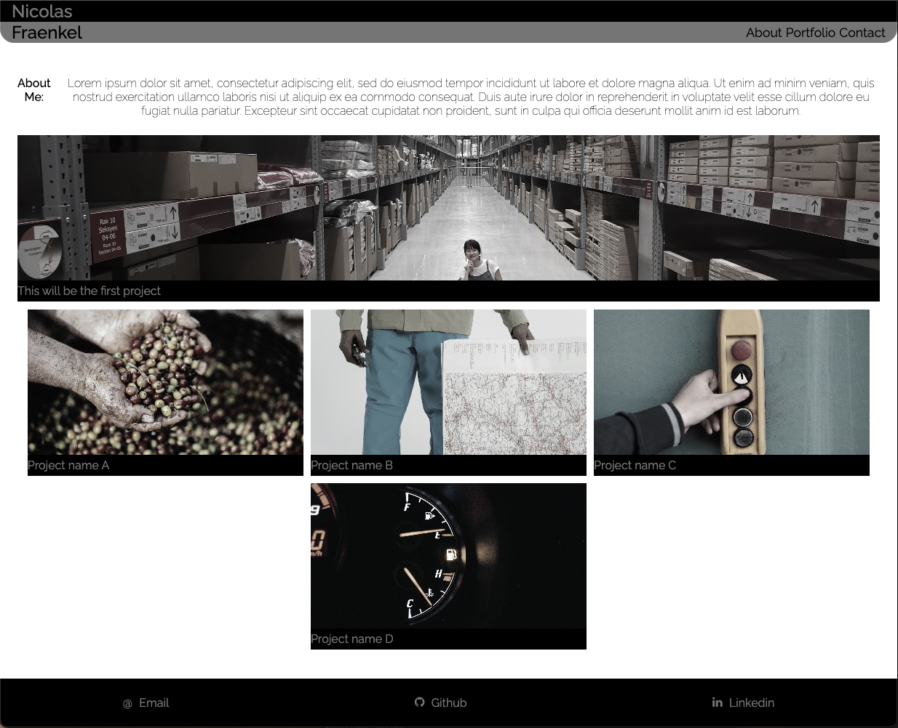

# WK02-challenge
WK02 Challenge - Portfolio Page


## Project Links.

[Github Repo](https://github.com/Kokkonut/WK02-challenge)

[Live Site](https://kokkonut.github.io/WK02-challenge/)

## Mockup of project




## Notable work done
All Acceptance critria met.


## Design considerations
At resolutions below 481px (ipad portrait) it didnt make sense to follow the accepance criteria. "WHEN I am presented with the developer's first application
THEN that application's image should be larger in size than the others"

as it makes the images to small to be easily viewed.


## Known issues
Project 3 "card" will on ocasion not resize correctly, I think it has something to do with the transition property applied to its parent class

Was not able to use ::before psuedo class on all footer icons due to no available unicode, instead used imported CSS file from font-awesome. ::before still used for one icon making css a little messy.


## Code refrances

[Mini CSS reset](https://gist.github.com/jgthms/b0b2af4983ebc957bc03f74d5805c160)

Added to existing code to suit needs

## Future Additions

At higher resolutions I want to change from a FlexBox based layout for the projects section to Grid, should allow for much "tighter formating" and also allow for some pretty awesome effects to be added.


## User Story

```
AS AN employer
I WANT to view a potential employee's deployed portfolio of work samples
SO THAT I can review samples of their work and assess whether they're a good candidate for an open position
```


## Acceptance Criteria

Here are the critical requirements necessary to develop a portfolio that satisfies a typical hiring manager’s needs:

```
GIVEN I need to sample a potential employee's previous work
WHEN I load their portfolio
THEN I am presented with the developer's name, a recent photo or avatar, and links to sections about them, their work, and how to contact them
WHEN I click one of the links in the navigation
THEN the UI scrolls to the corresponding section
WHEN I click on the link to the section about their work
THEN the UI scrolls to a section with titled images of the developer's applications
WHEN I am presented with the developer's first application
THEN that application's image should be larger in size than the others
WHEN I click on the images of the applications
THEN I am taken to that deployed application
WHEN I resize the page or view the site on various screens and devices
THEN I am presented with a responsive layout that adapts to my viewport
```


